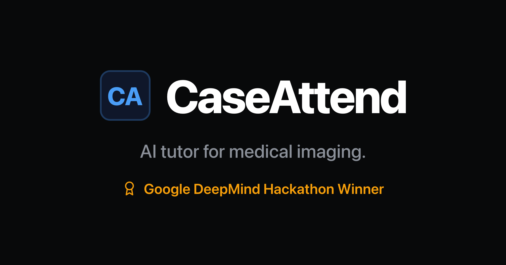
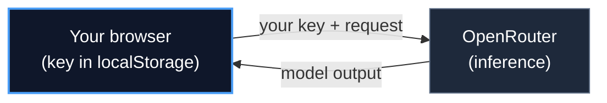
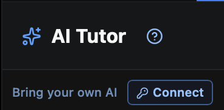
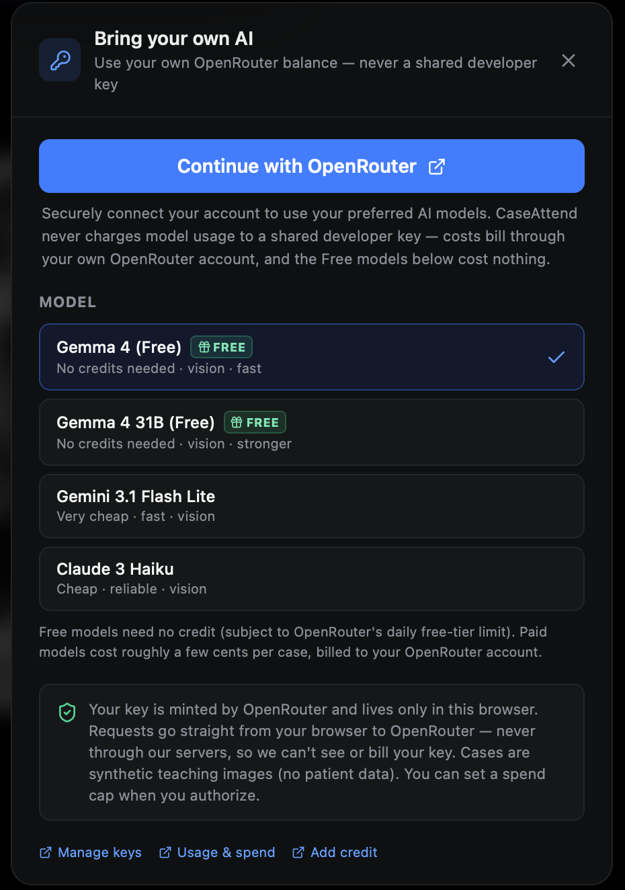
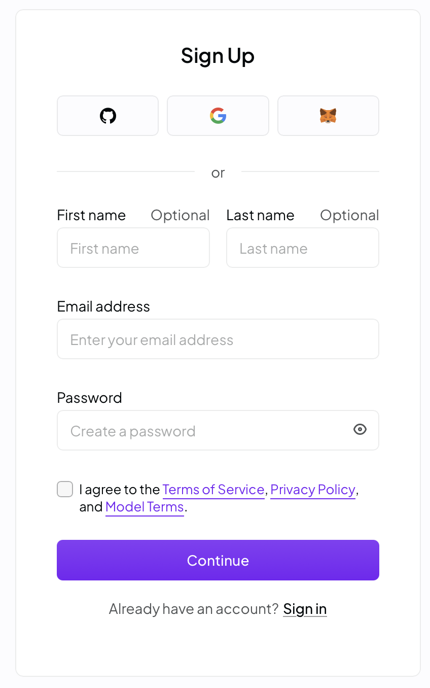
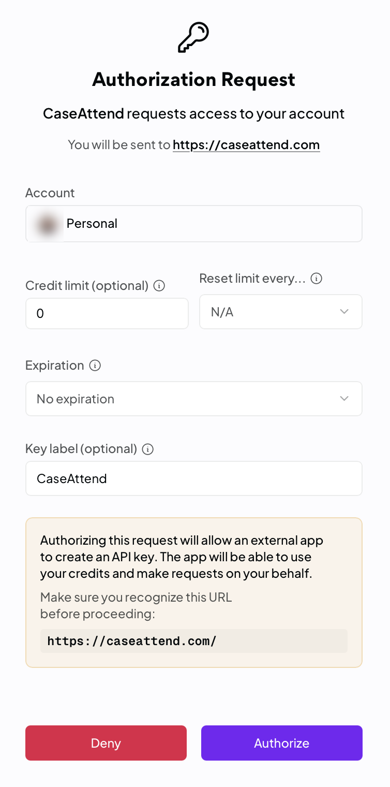
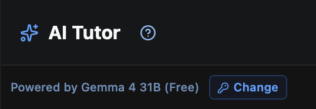
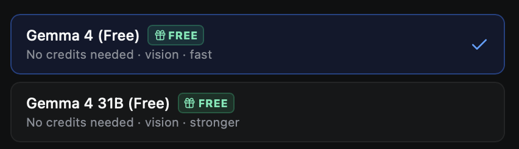

<h1 align="center">
  <a href="https://caseattend.com">
    
  </a>
</h1>

<p align="center">
  <a href="https://www.utmb.edu/news/article/utmb-news/2026/06/26/utmb-ai-innovators-win-international-hackathon-with-radiology-viewer-and-teaching-tool"></a>
  <a href="LICENSE"></a>
  <a href="https://github.com/JamesWeatherhead/CaseAttend/actions/workflows/ci.yml"></a>
  <a href="https://caseattend.com"></a>
</p>

<p align="center">
  <a href="https://react.dev/"></a>
  <a href="https://www.typescriptlang.org/"></a>
  <a href="https://vite.dev/"></a>
  <a href="https://tailwindcss.com/"></a>
  <a href="https://pages.cloudflare.com/"></a>
</p>

<p align="center">
  <b>Case-based visual reasoning tutor: radiology, pathology, dermatology.</b><br>
  Work through real medical images (chest X-rays, brain MRI, H&amp;E histology, clinical skin photographs) with an AI that teaches by asking, not telling.
</p>

<p align="center">
  <a href="https://caseattend.com"><b>Live demo</b></a>
  &nbsp;·&nbsp;
  <a href="https://www.utmb.edu/news/article/utmb-news/2026/06/26/utmb-ai-innovators-win-international-hackathon-with-radiology-viewer-and-teaching-tool">The story</a>
  &nbsp;·&nbsp;
  <a href="https://www.kaggle.com/competitions/gemini-3/writeups/new-writeup-1765065566929">Kaggle writeup</a>
  &nbsp;·&nbsp;
  <a href="SECURITY.md">Security</a>
  &nbsp;·&nbsp;
  <a href="CONTRIBUTING.md">Contributing</a>
</p>

---

> [!IMPORTANT]
> **One of 50 winners out of 4,096 entries** in the "Vibe Code with Gemini 3 Pro" Kaggle hackathon. CaseAttend grew out of that competition project, originally built as **VibeRad**, by [James Weatherhead](https://github.com/JamesWeatherhead), [Jake Weatherhead](https://github.com/JakeWeatherhead), [Peter McCaffrey](https://github.com/pmccaffrey6), and George Golovko.

> **Educational use only.** CaseAttend is a teaching tool, not a diagnostic or clinical decision-making system.

A **vision-language model (VLM)** is an AI model that can work with images and
words together. In CaseAttend, it can look at the same teaching artifact as the
learner, ask questions, and respond to what the learner notices. Many current
frontier models are VLMs, but the terms are not synonyms.

## Browser-stored key, direct-to-provider inference

CaseAttend stores **no API keys** in this repository or on a CaseAttend server. Your browser stores the key locally and sends it only to [OpenRouter](https://openrouter.ai) for inference. CaseAttend's backend never receives the key, case image, or chat. The selected model provider does receive the image and chat you submit through OpenRouter.



Your key only ever travels the browser-to-OpenRouter edge. Case Packages,
Lesson Plans, validation, prompt composition, and exports all run in the
browser. CaseAttend has no prompt or inference backend.

## See it in action

CaseAttend runs on **[OpenRouter](https://openrouter.ai)**. Sign in with OpenRouter's single sign-on (GitHub, Google, or email) and one account unlocks **every model on OpenRouter**, from free Gemma vision models to frontier Claude, Gemini, and GPT. Two vision models, **Gemma 4 (Free)** and **Gemma 4 31B (Free)**, cost nothing and need no credit, so anyone can use CaseAttend and help improve it **for free**: no payment method, no shared developer key, no server-side secrets.

<details>
<summary><b>Walk through the free, bring-your-own-key setup (6 steps)</b></summary>
<br>

<p align="center">
  
</p>
<p align="center"><em>1. Open CaseAttend and click <strong>Connect</strong>: no account or credit card just to arrive here.</em></p>

<p align="center">
  
</p>
<p align="center"><em>2. <strong>Continue with OpenRouter.</strong> Your key is stored in your browser and sent only to OpenRouter. CaseAttend servers never receive it. Pick a model; the <strong>Free</strong> ones cost nothing.</em></p>

<p align="center">
  
</p>
<p align="center"><em>3. Sign in with OpenRouter <strong>SSO</strong>: GitHub, Google, or email. One login gives you access to <strong>every model on OpenRouter</strong>.</em></p>

<p align="center">
  
</p>
<p align="center"><em>4. Authorize a scoped key and, if you like, set a <strong>spend cap</strong>. You stay in control of every cent; CaseAttend can never exceed it.</em></p>

<p align="center">
  
</p>
<p align="center"><em>5. Back in the app, now <strong>powered by Gemma 4 31B (Free)</strong>, running entirely on a free model.</em></p>

<p align="center">
  
</p>
<p align="center"><em>6. Two free vision models, <strong>Gemma 4 (Free)</strong> and <strong>Gemma 4 31B (Free)</strong>, mean the whole community can learn and contribute at <strong>zero cost</strong>. Switch to a frontier model anytime; that runs on your own OpenRouter balance.</em></p>

</details>

## Develop

```bash
npm install
npm run dev      # Vite dev server
npm run build    # production build -> dist/
```

Node 22+. No environment variables required.

## Stack

React 19 · TypeScript · Vite 8 · Tailwind 4, deployed on Cloudflare Pages as a static SPA.

## Case Package v1

Case Package v1 is the canonical metadata and provenance record for every
built-in teaching case. The validated registry in `src/data/caseRegistry.ts`
brings together learner-facing content, visual artifacts, viewer hints, source,
license, attribution, review status, and lesson-plan linkage. Cards, viewers,
and attribution surfaces read from this registry instead of maintaining
separate copies.

Every image or frame records the SHA-256 digest of its bytes. The package
manifest covers the educational metadata and those asset digests, so a change
to case content, viewer behavior, provenance, or image bytes changes the package
identity. A digest identifies bytes. It does not prove de-identification,
licensing, or clinical review.

Review claims are explicit. If reviewer or de-identification evidence is not
available, the package remains unreviewed using
`clinicianReview: { reviewed: false }` or `deidentification.status:
'not-reviewed'`. Public availability and older descriptive text are not review
evidence.

## Lesson Plan v1

Lesson Plan v1 turns teaching intent into portable, versioned data instead of
unstructured prompt files. Each plan records stable learning objectives,
supported learner levels, prerequisites, a Socratic opening, allowed hints,
escalation and stopping conditions, answer-revealing teaching notes, rubric
criteria with observable evidence, citations, and explicit clinical review
status.

Each citation declares whether it supports artifact provenance or clinical
teaching claims. A license deed can document redistribution terms, but it is
never presented as clinical evidence. The current built-in lessons record
artifact provenance and remain explicitly unreviewed with clinical sources
still needed. Search mode discloses that gap instead of inventing support.

Every plan has an educator-controlled semantic version and a deterministic
SHA-256 manifest. Its Case Package stores the exact `{id, version, sha256}`
reference, so a study or exported result can identify the teaching content that
was used. Unknown cases, wrong domains, and mismatched hashes fail closed rather
than falling back to another case or a generic assistant.

Choose **Build a lesson** on the case catalog to use the browser-local authoring
flow. The final review separates the policy fixed by CaseAttend from content
controlled by the educator. Export creates a portable Case Package plus Lesson
Plan bundle and never includes a key, chat transcript, screenshot, or unrelated
browser data. An unreviewed plan remains clearly labeled as a draft; the tool
does not grant clinical, institutional, or IRB approval.

## Contributing

PRs welcome. Read [CONTRIBUTING.md](CONTRIBUTING.md) first. Case content and
asset provenance belong in Case Package v1. Clinical and de-identification
review status must be accurate, image terms must permit redistribution, and
commits are signed off (DCO). Browser-only key storage, OpenRouter-only key
transmission, and the CaseAttend server boundary are non-negotiable; see
[SECURITY.md](SECURITY.md).

## Cite

If CaseAttend is useful in your research or teaching, please cite it. GitHub's **Cite this repository** button reads [CITATION.cff](CITATION.cff), or use:

```
Weatherhead, James; Weatherhead, Jake; McCaffrey, Peter; Golovko, George. (2026).
CaseAttend: a case-based visual reasoning tutor for medical education
(Version 0.2.0) [Computer software].
https://github.com/JamesWeatherhead/CaseAttend
```

## License

CaseAttend's source code is licensed under [AGPL-3.0](LICENSE) © 2026 James Weatherhead.

The bundled teaching images are third-party works under their own licenses and
are not covered by AGPL-3.0. Their canonical source, license, attribution,
review status, and byte-level SHA-256 digest are recorded in the Case Package v1
registry at `src/data/caseRegistry.ts`. The images remain under their original
terms.

**Commercial licensing.** AGPL-3.0 requires anyone who runs a modified version, including as a network service, to offer their source under the same terms. If that does not fit your use, for example embedding CaseAttend in a closed product or hosted service, a separate commercial license is available on request: contact James Weatherhead via [github.com/JamesWeatherhead](https://github.com/JamesWeatherhead).

<div align="center"><sub>AGPL-3.0 · © 2026 James Weatherhead</sub></div>
