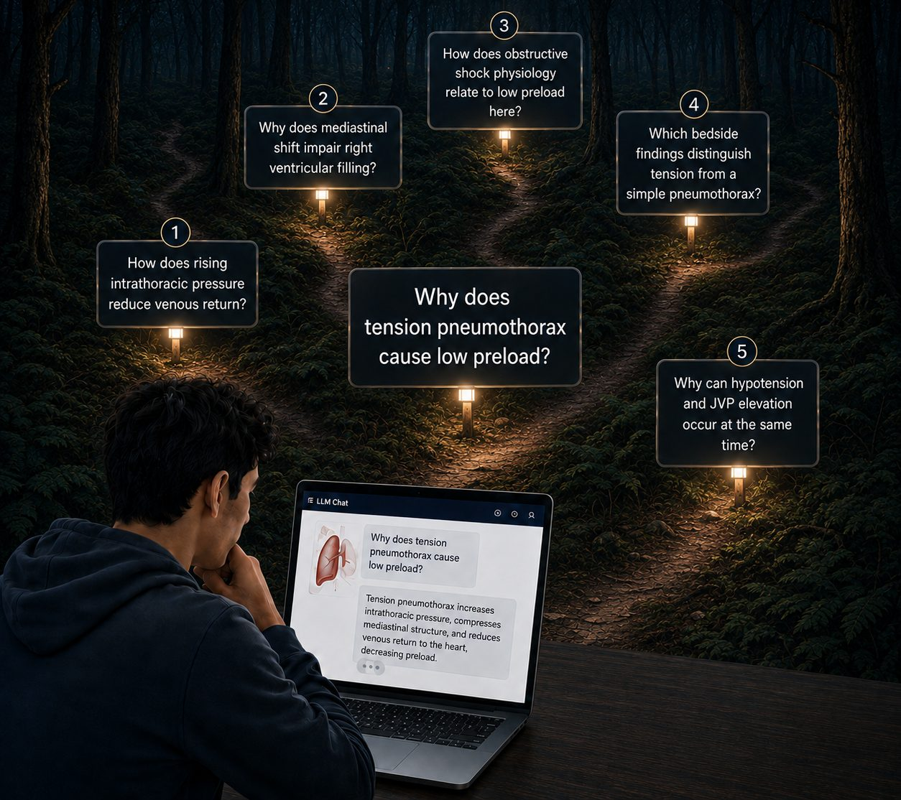
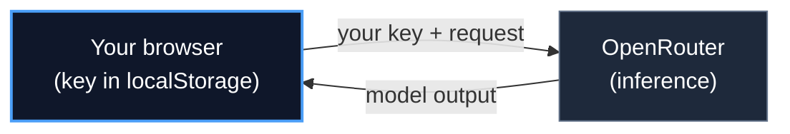

<h1 align="center">
  <a href="https://caseattend.com">
    
  </a>
</h1>

<p align="center">
  <a href="https://www.utmb.edu/news/article/utmb-news/2026/06/26/utmb-ai-innovators-win-international-hackathon-with-radiology-viewer-and-teaching-tool"></a>
  <a href="LICENSE"></a>
  <a href="https://github.com/JamesWeatherhead/CaseAttend/actions/workflows/ci.yml"></a>
  <a href="https://caseattend.com"></a>
</p>

<p align="center">
  <a href="https://react.dev/"></a>
  <a href="https://www.typescriptlang.org/"></a>
  <a href="https://vite.dev/"></a>
  <a href="https://tailwindcss.com/"></a>
  <a href="https://pages.cloudflare.com/"></a>
</p>

<p align="center">
  <b>Open-source, case-based visual tutoring for medical education, research, and product building.</b><br>
  The tutor sees what the learner sees while an educator-defined Lesson Plan keeps the conversation focused.
</p>

<p align="center">
  <a href="https://caseattend.com"><b>Live demo</b></a>
  &nbsp;·&nbsp;
  <a href="https://www.utmb.edu/news/article/utmb-news/2026/06/26/utmb-ai-innovators-win-international-hackathon-with-radiology-viewer-and-teaching-tool">The story</a>
  &nbsp;·&nbsp;
  <a href="https://www.kaggle.com/competitions/gemini-3/writeups/new-writeup-1765065566929">Kaggle writeup</a>
  &nbsp;·&nbsp;
  <a href="docs/research/README.md">Research guide</a>
  &nbsp;·&nbsp;
  <a href="docs/sdk/README.md">SDK guide</a>
  &nbsp;·&nbsp;
  <a href="SECURITY.md">Security</a>
  &nbsp;·&nbsp;
  <a href="CONTRIBUTING.md">Contributing</a>
</p>

---

> [!IMPORTANT]
> **One of 50 winners out of 4,096 entries** in the “Vibe Code with Gemini 3 Pro” Kaggle hackathon. CaseAttend grew from the original **VibeRad** project by [James Weatherhead](https://github.com/JamesWeatherhead), [Jake Weatherhead](https://github.com/JakeWeatherhead), [Peter McCaffrey](https://github.com/pmccaffrey6), and George Golovko.

> [!CAUTION]
> **Educational use only.** CaseAttend is a teaching tool, not a diagnostic or clinical decision-making system.

## What CaseAttend is

A **vision-language model (VLM)** can work across images and words. In CaseAttend, the model can inspect the same teaching artifact as the learner, respond to what the learner notices, and guide the next step. Many frontier models include vision capabilities, but “frontier model” and “VLM” are not interchangeable terms.

CaseAttend adds structure around that model:

- **Learn or teach:** work through built-in radiology, pathology, and dermatology cases, or create a local case and lesson in the browser.
- **Run education research:** freeze cases, lessons, model routing, capture rules, and structured outcomes with [Research Mode](docs/research/README.md).
- **Build a product or service:** compose your own domains, artifacts, model adapter, and storage around [`@caseattend/core`](docs/sdk/README.md), with an optional accessible React tutor.

## Why guided AI tutoring?

Early evidence suggests that carefully constrained AI tutors can improve learning when the tutoring behavior is deliberate:

- In a randomized controlled trial, undergraduates learned more in less time from a custom AI tutor than from an in-class active-learning session. They also reported greater engagement and motivation ([Kestin et al., *Scientific Reports*, 2025](https://doi.org/10.1038/s41598-025-97652-6)).
- In a quasi-experimental study of 293 first-year medical students, a course-grounded, Socratic ChatGPT-4o teaching assistant helped adopters close a pre-existing performance gap. Among adopters, academic-difficulty rates fell from 24.1% to approximately 5%, with students highlighting reliable support, efficiency, and a psychologically safe place to ask questions ([Sami et al., *Academic Medicine*, 2026](https://doi.org/10.1093/acamed/wvag208)).

CaseAttend applies these ideas to **case-based visual reasoning**: the tutor sees the artifact, while the Lesson Plan defines the educational objective and how the tutor should help the learner reach it.

## The stochastic LLM forest

Generic LLM chat is excellent for open-ended exploration. It is less reliable as the structure of a lesson.

Each answer creates several plausible next questions. Each follow-up creates several more. After only a few turns, the learner may be deep in an interesting conversation but far from the original objective. That branching space is the **stochastic LLM forest**.

<p align="center">
  
</p>

**CaseAttend keeps the lesson lit with [Lesson Plan v1](#lesson-plan-v1).** Each portable, versioned plan defines:

- learning objectives and prerequisites;
- the Socratic opening and allowed hints;
- escalation and stopping conditions;
- teaching notes and rubric criteria; and
- citations and clinical-review status.

Every conversation is bound to a specific plan and its deterministic SHA-256 manifest. The learner can still explore, but the tutor does not lose the destination.

*The forest is still there. The lesson stays lit.*

**Implementation:** [`src/core/lessonPlan.ts`](src/core/lessonPlan.ts) · [`src/data/lessonRegistry.ts`](src/data/lessonRegistry.ts) · [`docs/sdk/README.md`](docs/sdk/README.md)

## How a session works

1. The learner opens a case and inspects its visual artifact.
2. The learner asks a question or submits an observation.
3. On **Send**, CaseAttend transmits the current view and conversation to OpenRouter and the selected model provider.
4. The tutor responds within the objectives, hints, escalation rules, and rubric encoded by the active Lesson Plan.
5. Optional browser-local events record structured metadata for learning analytics or research without storing raw chat or images.

## Privacy boundary

CaseAttend is a static browser application with **no prompt or inference backend**.

- The OpenRouter key is stored locally in the learner’s browser.
- The key is sent only from the browser to [OpenRouter](https://openrouter.ai).
- CaseAttend’s static hosting layer receives neither the key nor the inference request.
- OpenRouter and the selected upstream model provider **do receive** the image and chat submitted for inference.
- Case Packages, Lesson Plans, validation, prompt composition, and exports run locally in the browser.



See [SECURITY.md](SECURITY.md) for the complete trust boundary and security model.

## Try CaseAttend

CaseAttend uses **[OpenRouter](https://openrouter.ai)**. Sign in with GitHub, Google, or email, then choose from OpenRouter’s model catalog. The included **Gemma 4 (Free)** and **Gemma 4 31B (Free)** options require no credit or payment method; paid models use your own OpenRouter balance. There is no shared developer key and no CaseAttend-held server secret.

<details>
<summary><b>Free bring-your-own-key setup, step by step</b></summary>
<br>

<p align="center">
  
</p>
<p align="center"><em>1. Open CaseAttend and select <strong>Connect</strong>.</em></p>

<p align="center">
  
</p>
<p align="center"><em>2. Continue with OpenRouter. Your key stays in the browser and is sent only to OpenRouter.</em></p>

<p align="center">
  
</p>
<p align="center"><em>3. Sign in with GitHub, Google, or email.</em></p>

<p align="center">
  
</p>
<p align="center"><em>4. Authorize a scoped key. You may also set a spending limit.</em></p>

<p align="center">
  
</p>
<p align="center"><em>5. Return to CaseAttend with your selected model connected.</em></p>

<p align="center">
  
</p>
<p align="center"><em>6. Use a free vision model or switch to a paid frontier model on your own OpenRouter balance.</em></p>

</details>

## Develop locally

```bash
npm ci
npm run dev      # Vite development server
npm run build    # production build -> dist/
```

Requires **Node 22+**. No environment variables are required.

### Try the SDK without an account, credential, patient data, or external model request

```bash
npm run example:basic
npm run example:research
npm run build:sdk
npm run pack:sdk       # build and inspect the publishable package
```

Start with the [SDK guide](docs/sdk/README.md), then inspect the [basic teaching example](examples/basic) or the [memory-only research adapter example](examples/self-hosted-research).

The SDK packages are versioned independently at `0.1.0`. Their raw-free event contract is version `1.0`.

**Stack:** React 19 · TypeScript · Vite 8 · Tailwind 4 · Cloudflare Pages

## Core building blocks

| Component | Purpose |
| --- | --- |
| [Case Package v1](#case-package-v1) | Defines the case, visual artifacts, provenance, licensing, and review state. |
| [Lesson Plan v1](#lesson-plan-v1) | Defines what should be learned and how the tutor should guide the learner. |
| [Case Studio](#case-studio) | Creates portable teaching cases locally in the browser. |
| [Browser-local session events](#browser-local-session-events) | Records structured, metadata-only learning events. |
| [Research Mode](#research-mode) | Freezes a reproducible study protocol and produces restricted exports. |

### Case Package v1

Case Package v1 is the canonical metadata and provenance record for each built-in teaching case. The validated registry in [`src/data/caseRegistry.ts`](src/data/caseRegistry.ts) keeps learner-facing content, visual artifacts, viewer hints, source, license, attribution, review status, and Lesson Plan linkage in one place. Cards, viewers, and attribution surfaces read from this registry rather than maintaining separate copies.

Each image or frame records the SHA-256 digest of its bytes. The package manifest covers both the educational metadata and the asset digests, so any change to the case, provenance, viewer behavior, or image bytes changes the package identity.

> [!NOTE]
> A digest identifies bytes. It does **not** prove de-identification, licensing, or clinical review.

Review claims remain explicit. Without supporting evidence, a package stays unreviewed through `clinicianReview: { reviewed: false }` or `deidentification.status: 'not-reviewed'`. Public availability and older descriptive text are not treated as review evidence.

### Lesson Plan v1

Lesson Plan v1 stores teaching intent as portable, versioned data rather than an unstructured prompt file. A plan can define:

- stable learning objectives and learner levels;
- prerequisites and a Socratic opening;
- allowed hints, escalation rules, and stopping conditions;
- answer-revealing teaching notes;
- rubric criteria with observable evidence; and
- citations and explicit clinical-review status.

Each citation states whether it supports **artifact provenance** or a **clinical teaching claim**. A license deed can document redistribution terms, but it is never presented as clinical evidence. The current built-in lessons record artifact provenance and remain explicitly unreviewed where clinical sources are still needed; search mode discloses that gap instead of inventing support.

Every plan has an educator-controlled semantic version and deterministic SHA-256 manifest. Its Case Package stores the exact `{id, version, sha256}` reference. Unknown cases, incorrect domains, and mismatched hashes fail closed instead of falling back to a generic assistant.

Choose **Build a lesson** in the case catalog to use the browser-local authoring flow. The final review distinguishes policy fixed by CaseAttend from content controlled by the educator. Export creates a portable Case Package and Lesson Plan bundle. It never includes a key, chat transcript, screenshot, or unrelated browser data. Draft plans remain visibly unreviewed; CaseAttend does not grant clinical, institutional, or IRB approval.

### Case Studio

Choose **Create a case** in the catalog to turn JPEG, PNG, or WebP images into a versioned teaching case without writing code.

Case Studio works locally in the browser. It re-encodes images, orders a single image or image stack, and collects accessible descriptions, provenance, redistribution terms, attribution, and an explicit synthetic or de-identification attestation. A single dermatology photograph remains a native one-image artifact rather than being treated as a one-slice scan.

The privacy screen uses self-hosted browser OCR and face detection when supported. Recognized text is discarded; only warning counts and status remain.

> [!WARNING]
> These checks are advisory. They do not establish HIPAA de-identification, consent, IRB status, permission to publish, or clinical suitability. A person must review every image and authored field before saving.

Raw DICOM is intentionally deferred because DICOM metadata and burned-in pixel identifiers require an institution-managed clinical-data workflow.

Saved cases live in IndexedDB, with a visible memory-only fallback when persistent storage is unavailable. Portable `.caseattend` files are strict ZIP archives containing exactly one linked Case Package, one exact starter Lesson Plan, and the referenced re-encoded image bytes. They exclude the OpenRouter key, chat, session logs, original filenames, and unrelated browser data.

Opening a saved case remains local. Data is sent externally only after a learner action such as **Send**.

### Browser-local session events

CaseAttend can record a versioned, metadata-only learning event stream in the learner’s browser. Events can bind a session to:

- the exact Case Package and Lesson Plan;
- the application version;
- the submitted frame hash and annotation counts;
- learner level and model request metadata; and
- timing and token usage, when returned by the provider.

The schema has no fields for raw chat, prompts, screenshots, image data, annotation coordinates, names, emails, API keys, or authorization headers.

IndexedDB is the default store. If it is unavailable, CaseAttend falls back to memory for the current tab and warns that the data will be lost when the page closes. The **Session data** panel lets learners preview, export, or delete their records. JSONL is the canonical export; CSV provides a fixed analysis-friendly table. Recording, preview, export, and deletion make no network request.

These ordinary session records are separate from the durable pseudonymous store and restricted exports used by Research Mode.

### Research Mode

Research Setup lets a study team freeze a reproducible VLM-education protocol: exact cases, lessons, prompts, model routing, sampling, viewer and capture rules, assignment, and structured pre/post tasks. Participants then run a locked activity against that manifest.

<details>
<summary><b>Research safeguards, participant identity, and exports</b></summary>
<br>

Participant information is English-only in v1. Study teams must provide an institutionally reviewed workflow outside CaseAttend for other languages.

The study team issues each 20-character high-entropy participant code outside CaseAttend and remains responsible for eligibility, linkage, duplicate use, and withdrawal. The entered code is transient: CaseAttend derives and stores only a manifest-scoped pseudonymous reference, then clears the raw code.

> [!IMPORTANT]
> Pseudonymous data can still be linkable and must not be described as anonymous.

Browser-local Participant Mode fails closed unless:

- IndexedDB is persistent;
- an external institutional determination is recorded;
- raw-chat collection is off; and
- each case is marked synthetic or carries a de-identification attestation.

These gates are workflow controls, not proof of consent, approval, de-identification, or compliance.

When a participant presses **Send**, the browser sends the frozen system prompt, learner message, and current-view JPEG to OpenRouter and the locked upstream model provider. Bring-your-own-key protects the credential boundary: the key is never written to research records or exports. It does **not** prevent OpenRouter or the upstream provider from receiving the request payload. CaseAttend’s static application server receives neither the key nor the inference request.

Research Mode creates two separate local downloads:

- The **research support packet** contains the frozen manifest, exact prompts, portable case and lesson archives, editable institutional-review templates, and checksums. It contains no participant runs or research records.
- The **restricted research-data export** contains the study reference, pseudonymous runs, and closed-vocabulary event records in JSONL or CSV. It excludes raw learner or model text, prompts, images, screenshots, direct identifiers, authentication keys, and Case Package or Lesson Plan bodies.

Neither download is automatically uploaded or encrypted. The study team remains responsible for approved storage, transfer, access, retention, and deletion.

CaseAttend does not grant IRB or ethics approval, establish HIPAA de-identification or HIPAA/FERPA compliance, or replace legal, privacy, security, accessibility, and institutional review.

</details>

Start with the [Research workflow guide](docs/research/README.md).

## Contributing

Pull requests are welcome. Read [CONTRIBUTING.md](CONTRIBUTING.md) first.

Case content and asset provenance belong in Case Package v1. Clinical and de-identification review status must be accurate, image terms must permit redistribution, and commits must be signed off under the DCO.

Browser-only key storage, OpenRouter-only key transmission, and the CaseAttend server boundary are non-negotiable. See [SECURITY.md](SECURITY.md).

## Cite

GitHub’s **Cite this repository** button reads [CITATION.cff](CITATION.cff). You may also use:

```text
Weatherhead, James; Weatherhead, Jake; McCaffrey, Peter; Golovko, George. (2026).
CaseAttend: a case-based visual reasoning tutor for medical education
(Version 0.5.0) [Computer software].
https://github.com/JamesWeatherhead/CaseAttend
```

## License

CaseAttend source code is licensed under the [MIT License](LICENSE) © 2026 James Weatherhead. Third-party runtime components are listed in [THIRD_PARTY_NOTICES.md](THIRD_PARTY_NOTICES.md).

Bundled teaching images are third-party works under their own licenses and are not covered by CaseAttend’s MIT license. Their canonical source, license, attribution, review status, and byte-level SHA-256 digest are recorded in the Case Package v1 registry at [`src/data/caseRegistry.ts`](src/data/caseRegistry.ts). The images remain under their original terms.

**Building on CaseAttend.** The MIT License allows use, modification, and redistribution of the code, including in closed-source and commercial products, at no charge. You must retain the copyright and license notice in copies or substantial portions of the software. This summary is not legal advice; the [license text](LICENSE) controls.

<div align="center"><sub>MIT · © 2026 James Weatherhead</sub></div>
