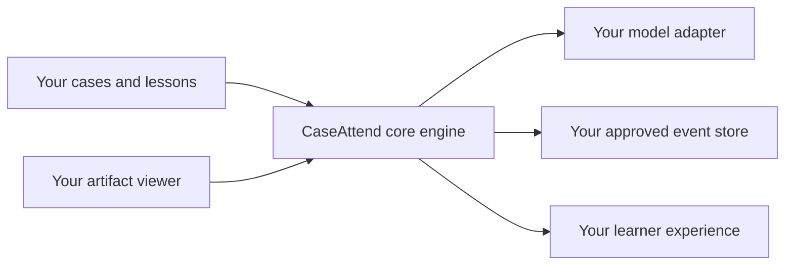

# Adapt CaseAttend with the SDK

[← Documentation home](../README.md)

The SDK is the advanced path for a team that wants CaseAttend's teaching structure inside another product. It separates the reusable teaching engine from the current website, so an engineering team can provide its own visual artifacts, domains, model connection, interface, and storage.

Start with the complete [technical SDK guide](../sdk/README.md). This page helps educators, program leads, privacy reviewers, and engineers agree on the adaptation before implementation begins.

## Use the SDK when

- the tutor must live inside an existing learning platform;
- your domain needs a viewer or vocabulary that CaseAttend does not provide;
- your organization needs a different model provider or an approved local model;
- storage must follow an institution-specific design; or
- a product team wants to reuse the teaching engine without copying the CaseAttend interface.

If you only need new cases, lessons, or branding, begin with the [no-code path](no-code.md) or a [self-hosted copy](self-host-cloudflare.md). An SDK integration is software development and should have an accountable engineering owner.

## The adaptation map



The engine coordinates the lesson. Your application supplies the capabilities around it.

| Decision | What your team supplies | Question for the program owner |
| --- | --- | --- |
| Case catalog | Validated cases and their exact lesson references | Who owns content quality, provenance, rights, and retirement? |
| Artifact loading | A way to resolve a declared artifact into bytes | Which code and organizations can receive the raw artifact? |
| Domain language | Labels and viewer capabilities for your field | What vocabulary is appropriate for the intended learners? |
| Prompt composition | The exact instructions sent to the model | Who reviews educational intent, answer-revealing content, and safety language? |
| Model inference | A provider adapter that performs the request | Where do the credential, learner text, and artifact bytes go? |
| Event storage | A teaching store or a separately configured research sink | What is collected, why, for how long, and who can delete or access it? |
| Learner interface | Your own UI or the accessible React composer | How will you test keyboard, screen-reader, zoom, reflow, status, and error behavior? |

## Preserve the important boundary

The SDK never needs a provider credential as an engine input. Keep the key inside the model adapter's private boundary, and never add it to a case, lesson, event, export, URL, error report, or analytics payload.

The core event format intentionally has no place for learner text, model text, prompts, image bytes, screenshots, credentials, names, or email addresses. Preserve that data-minimizing contract unless a separate, reviewed product requirement explicitly replaces it.

> [!WARNING]
> Adapters are trusted application code, not isolated plug-ins. A model adapter receives the content needed for inference; an artifact loader can read artifact bytes; a completion callback may receive raw turn content. Adding or replacing one changes who can see data.

The technical guide explains the [explicit submit boundary](../sdk/README.md#explicit-submit-boundary), and [SDK privacy and accessibility defaults](../sdk/privacy-and-accessibility.md) lists the review questions for each extension point.

## Plan the adaptation on one page

Before an engineer writes an adapter, complete this brief together:

### Learning purpose

- Intended learners:
- Visual or other artifact they will inspect:
- Observable learning objective:
- Evidence that would count as progress:
- Situations where the tutor should stop or defer:

### Content governance

- Case and lesson owner:
- Clinical or subject-matter reviewer:
- Source and licensing reviewer:
- Versioning and withdrawal process:
- Rehearsal and release criteria:

### Data flow

- Every organization that receives learner text:
- Every organization that receives artifact bytes:
- Where provider credentials live:
- Exact metadata stored for ordinary teaching:
- Separate research collection, if any:
- Retention, access, deletion, and incident owners:

### Learner experience

- Viewer controls and accessible alternative:
- Supported devices and browsers:
- How model use and external destinations are disclosed:
- Loading, timeout, refusal, and unavailable-provider behavior:
- Human help or escalation route:

If the team cannot answer one of these questions, record it as an open decision rather than allowing the code to answer by accident.

## Build in stages

1. **Run the local examples.** They use synthetic material and deterministic local responses, so the team can inspect the boundary without an account, credential, patient data, or external model call.
2. **Replace one capability at a time.** Start with your case catalog and artifact view, then the lesson, then the learner interface. Add live inference only after the data-flow review.
3. **Keep the first provider adapter narrow.** Declare one destination, hold its credential privately, and document exactly what it receives.
4. **Start ordinary teaching without a research sink.** Research collection needs a separate purpose, protocol, participant workflow, and institutional determination.
5. **Test failure as carefully as success.** Include invalid content, missing artifacts, stale lesson references, model timeouts, provider refusals, keyboard-only use, and screen-reader status changes.
6. **Pilot with synthetic or explicitly approved material.** Observe whether the tutor elicits reasoning and follows the lesson, then revise before broader use.

## Technical handoff

An engineer can begin from a fresh clone with a repository-supported Node release (`^22.22.2`, `^24.15.0`, or `>=26.0.0`):

```bash
npm ci
npm run example:basic
npm run example:research
npm run build:sdk
```

The useful starting points are:

- [`@caseattend/core`](../../packages/core/README.md): headless teaching orchestration, with no React, browser storage, or built-in model provider;
- [`@caseattend/react`](../../packages/react/README.md): an accessible tutor composer around a configured engine;
- [basic example](../../examples/basic/README.md): a small teaching integration with local deterministic responses; and
- [self-hosted research example](../../examples/self-hosted-research/README.md): a synthetic, memory-only illustration—not a production collector or approval workflow.

Before release, run the verification commands in the [technical SDK guide](../sdk/README.md#build-and-verify) and review [SDK licensing](../sdk/licensing.md). CaseAttend code is MIT-licensed, while case images, datasets, trademarks, privacy obligations, and clinical-use claims are separate matters.

## Definition of ready

An adaptation is ready for a limited pilot only when the team can point to:

- an exact, versioned case and lesson;
- accountable content, clinical, privacy, security, accessibility, and operational owners;
- a diagram naming every destination for text, artifact bytes, and credentials;
- tested behavior for model and storage failures;
- a learner-facing explanation of what is sent and when;
- an approved way to withdraw or correct content; and
- a measurement plan that can reveal when the experience is not helping.

The SDK makes CaseAttend adaptable. It does not transfer these decisions from the adopting organization to the software.
