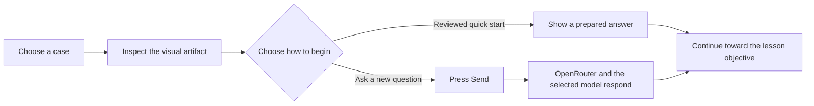

# How CaseAttend works

[← Documentation home](README.md)

CaseAttend joins three things that are often scattered across slides, image viewers, and chat windows: a **visual case**, an **educator-authored lesson**, and a **guided conversation**.

The learner can explore. The lesson keeps that exploration pointed toward a stated educational goal.

> [!CAUTION]
> CaseAttend is for education. It does not diagnose, recommend patient care, verify clinical claims, or replace a qualified educator's judgment.

## The three layers

| Layer | What it holds | Why it matters |
| --- | --- | --- |
| **Case Package** | The image or image sequence, learner-facing context, attribution, usage terms, and review state | The visual material remains connected to its source and exact version. |
| **Lesson Plan** | Objectives, prerequisites, opening question, hints, escalation and stopping rules, teaching notes, sources, and review state | The tutor has a destination instead of improvising the entire lesson. |
| **Tutor session** | The learner's current view, question, relevant conversation, case context, and active Lesson Plan prompt | The model can respond to what the learner is examining while following the educator-authored lesson. |

Case and lesson records have educator-controlled IDs and deterministic content hashes. When the content changes, its hash changes too. That makes it possible to say which exact teaching revision a learner or study used.

## A learner's path

### 1. Choose a case and learner level

The learner opens a built-in or browser-local case, selects the appropriate teaching level, and inspects the visual artifact. The case's neutral description provides orientation without intentionally revealing the teaching answer.

### 2. Start with reviewed material or connect a model

Many lessons include a small **intro cache**: an opening prompt and a few prepared questions for each learner level. The answers may have been drafted with a model, but they do not become learner-facing until a named reviewer approves them. Clicking one shows the stored answer immediately and does not trigger a new model inference request.

A cache is accepted only when it is approved and still matches the exact lesson. If the lesson changes, the old cache is treated as stale. An educator who creates a browser-local case can generate a cache draft after connecting OpenRouter, edit every level and answer, and then record review before approval.

The cache is a **guided first step**, not an offline version of the full tutor. A new, free-form question needs a connected OpenRouter key and a live model request.

### 3. Submit a live question intentionally

Nothing is sent to a model merely because the learner opened, zoomed, or annotated a case. When the learner presses **Send**, the browser prepares the current view, message, relevant conversation, case context, and active Lesson Plan instructions—including educator teaching notes—then sends the request directly to OpenRouter. OpenRouter routes it to the selected model provider, and the response returns to the browser.

The active Lesson Plan helps shape that exchange. It tells the tutor what the learner should work toward, which hints are allowed, when to become more explicit, and when to conclude. A lesson reduces drift; it cannot guarantee that every generated answer will be accurate or pedagogically effective.

### 4. Keep the learner in control

The learner can continue inspecting the artifact between turns. The tutor is designed to ask focused questions and elicit reasoning rather than reveal everything at once. Educators should rehearse the lesson at every intended level and revise prompts or rules that behave poorly.

## What stays local—and what leaves the browser

“Browser-local” describes particular operations. It does not mean that every feature is offline or that no external service ever receives data.

| Action | What happens |
| --- | --- |
| Open the website or a built-in case | The browser downloads the static app and its published teaching assets from the host, as with an ordinary website. |
| Create or edit a case and lesson | Validation, image preparation, lesson editing, hashing, and export happen in the browser. Cases created in Case Studio are stored in IndexedDB when available, with a visible memory-only fallback. Lesson Builder does not autosave every draft path; validate and export before leaving. |
| Import a PDF or PowerPoint into Lesson Builder | CaseAttend extracts selectable PDF text or text from non-hidden PowerPoint slides in the browser and creates an editable draft. It does not store or export the raw source document, filename, speaker notes, or embedded media. Applied text becomes Lesson Plan content and may enter later provider prompts. Scanned-image PDFs may have no selectable text. |
| Click a reviewed intro-cache question | The stored answer appears without a new model request and without an API key. |
| Press **Send** for a live turn | The current-view capture, learner message, relevant conversation, case context, and active Lesson Plan prompt—including educator teaching notes—go to OpenRouter and the selected model provider. |
| Select **Generate intro cache** as an educator | Case context, objectives, teaching notes, and up to four representative case images go to OpenRouter and the selected provider. The returned draft—and any later browser approval—remains browser-local. |
| Store or export ordinary learning events | The metadata-only event records remain in the browser; the schema excludes raw chat, prompts, images, screenshots, names, emails, and credentials. |
| Export a portable case | The package contains the validated case, linked lesson, and prepared image copies—not the OpenRouter key, original filenames, chat, or unrelated browser data. |

The OpenRouter key is stored in the browser and sent only to OpenRouter. CaseAttend's static hosting layer does not receive the key or proxy the inference request. This protects the credential boundary; it does **not** hide the submitted content from OpenRouter or the selected provider.

Read the complete [security model](../SECURITY.md) before using live AI with institutional material.

## Building teaching material

CaseAttend offers two browser-local authoring paths:

- **Case Studio** prepares JPEG, PNG, or WebP images, gathers provenance and usage information, runs advisory local privacy checks, and creates an unreviewed starter lesson.
- **Lesson Builder** turns teaching intent into objectives, evidence, hints, escalation rules, stopping conditions, citations, and an explicit review state. A PDF or PowerPoint can supply an editable text draft, but never a finished lesson.

Automated image screening can miss identifiers. Re-encoding an image can remove ordinary source metadata, but it cannot remove a name or number burned into the pixels. A human must review the images and authored text under the institution's own approved process.

## What “reviewed” means

CaseAttend records claims; it does not certify them.

- **Rights recorded** means an author entered provenance and reuse information. The institution remains responsible for confirming permission.
- **De-identification attested** means a person recorded an attestation. It is not a CaseAttend determination of HIPAA compliance.
- **Clinician reviewed** means a named reviewer and credentials were recorded for that exact content version. CaseAttend does not verify the person's identity or grant institutional approval.
- **Intro cache approved** means the prepared opening material passed its separate review gate. It does not validate every future live model response.

Licensing, privacy review, clinical review, accessibility review, and IRB or ethics determination are distinct responsibilities. Completing one does not complete the others.

## Research Mode is deliberately separate

Research Mode can freeze the exact case, lesson, model route, capture rules, and structured outcomes used in a protocol. It uses a separate locked path and does not use the ordinary intro cache as a substitute for the study's pinned live model.

CaseAttend does not decide whether an activity is research, obtain consent, issue participant identities, grant IRB or ethics approval, or operate a multi-participant data service. Start with the [Research Setup guide](research/README.md) and your institution's own review process.

## Choose your next path

- **Learner:** [Complete your first case](getting-started/first-case.md)
- **Educator:** [Create a visual teaching case](guides/create-a-case.md), then [build its lesson](guides/build-a-lesson.md)
- **Program lead:** [Adapt CaseAttend without code](adapt/no-code.md) or [self-host on Cloudflare Pages](adapt/self-host-cloudflare.md)
- **Product team:** [Adapt the SDK](adapt/sdk.md)
- **Curious collaborator:** [Read the VibeRad-to-CaseAttend story](story/google-deepmind-win.md)
