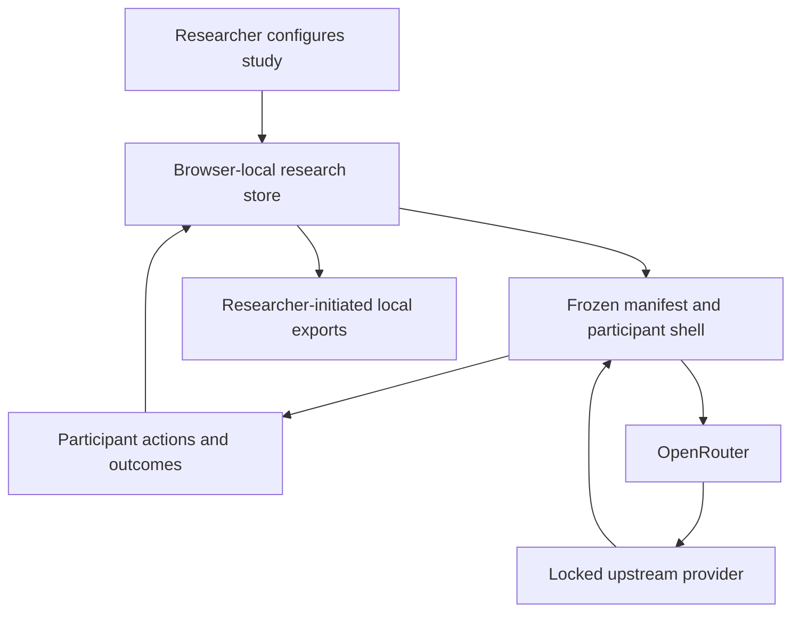

# Research data flow

This document describes the browser-only default and the separate model-provider boundary. Verify the deployed build and provider terms for each protocol.

## Boundary inventory

| Boundary | Data that may cross | Required review |
| --- | --- | --- |
| Researcher to browser store | Draft protocol, exact artifact references, review records | Device access, shared-browser risk, backup and deletion plan |
| Participant to browser runtime, transient only | Institution-issued 20-character code | Code format; external eligibility, issuance, linkage, reuse, and withdrawal controls; raw code must be cleared after derivation |
| Participant to browser research store | Manifest-scoped pseudonymous reference, structured actions, outcomes, configured session metadata | Data minimization, access, retention, withdrawal limits; the raw participant code is not stored |
| Browser to OpenRouter | Browser-held OpenRouter key plus frozen system prompt, participant message, and current-view JPEG | OpenRouter terms, retention, training, region, subprocessors, and institutional agreement |
| OpenRouter to the exact upstream model provider | Inference payload needed for the locked model route; never the participant's OpenRouter key | Recorded upstream-provider HTTPS policy, retention, training, region, subprocessors, and institutional agreement |
| Browser to research support packet | Frozen manifest, exact prompts, portable case/lesson archives, editable templates, checksums | Contains study content but no participant runs or research records; storage, transfer, access, and deletion |
| Browser to restricted research-data JSONL/CSV | Study reference, pseudonymous runs, closed-vocabulary event records | Restricted coded data; external encryption, transfer destination, access, retention, and deletion |

## Important distinctions

- Browser-local does not mean anonymous. A derived pseudonymous reference, timestamps, or rare interaction pattern can be identifying when combined with other information.
- Pseudonymous codes should be assigned outside CaseAttend. Do not enter names, email addresses, record numbers, or a direct identifier as the code.
- The raw code is transient. CaseAttend stores only the manifest-scoped derived reference; the study team keeps any linkage key and controls code reuse outside CaseAttend.
- OpenRouter and the locked upstream provider receive visual and textual study content when a participant invokes the model. CaseAttend does not proxy that request.
- The OpenRouter key stays in browser-local storage, is attached only to OpenRouter requests, and is excluded from research records and exports. This protects the credential boundary, not the inference payload, and the key remains sensitive on the device.
- Each arm records the reviewed upstream provider policy URL separately from the OpenRouter endpoint and policy.
- A current-view capture can include participant annotations. The frozen capture policy must match the protocol and participant information.
- Raw conversation content is off by default and browser-local Participant Mode refuses to launch when it is enabled. An enabled raw-chat policy is support-packet documentation for a separately reviewed institution-managed implementation.
- Deleting browser-local records does not delete copies already exported or retained by a model provider.
- Support packets and restricted participant-data exports are different downloads. Neither is automatically uploaded or automatically encrypted.

## Before participant launch

- Test the exact production origin, browser, model, provider, and storage mode.
- Confirm IndexedDB remains persistent after reload and under expected device policies.
- Review every enabled data field against the stated outcomes.
- Verify the participant-facing description matches the frozen provider, capture, and raw-chat policy.
- Verify the browser-held key invariant and the exact upstream-provider allowlist in the deployed build; provider fallback must remain off.
- Confirm every launched case is synthetic or carries a de-identification attestation, while documenting that this package metadata is not proof of legal or institutional sufficiency.
- Document who can export, decrypt, analyze, and delete the data.
- Record the institution's required determination outside CaseAttend.
